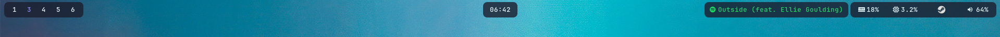

### Dock Bar:


### Full Bar:


### Preview:<br />


Waybar Layout Selector: << update the paths in scripts/waybar-selector.sh to match your system >>

> [!TIP] 
The hyprland bind + windowrule below are recommended for waybar-selector tool:
```lua
hl.window_rule({ match = { initial_class = "waybar-selector" }, float = true, center = true, size = { 460, 140 } })
```
```lua
hl.bind(mainMod .. " + SHIFT + B", hl.dsp.exec_cmd("~/.config/waybar/scripts/waybar-selector.sh"))`
```

### Spotify module:
[left click ~ previous song] &nbsp; • &nbsp;  [middle click - pause/play] &nbsp; • &nbsp;  [right click - next]


